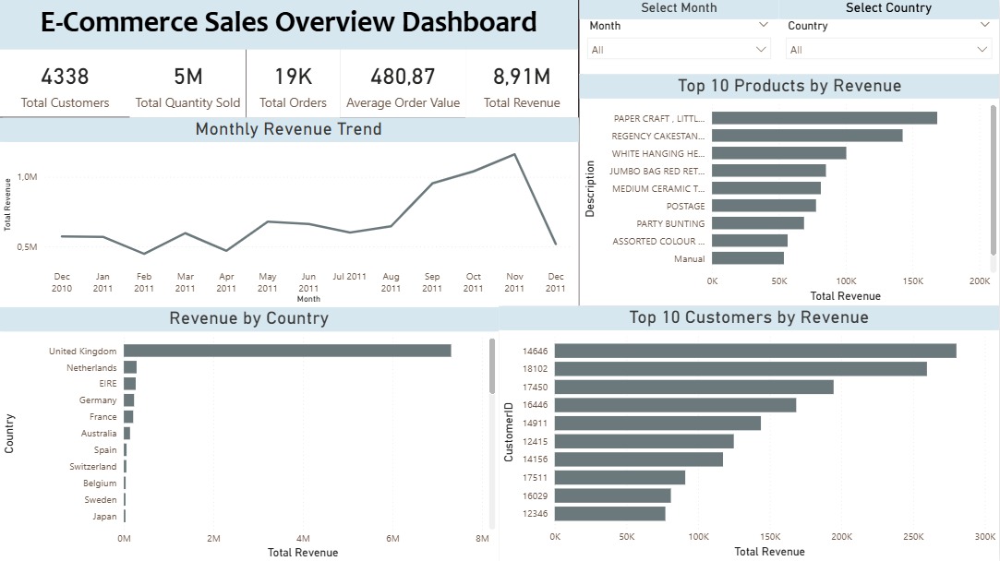
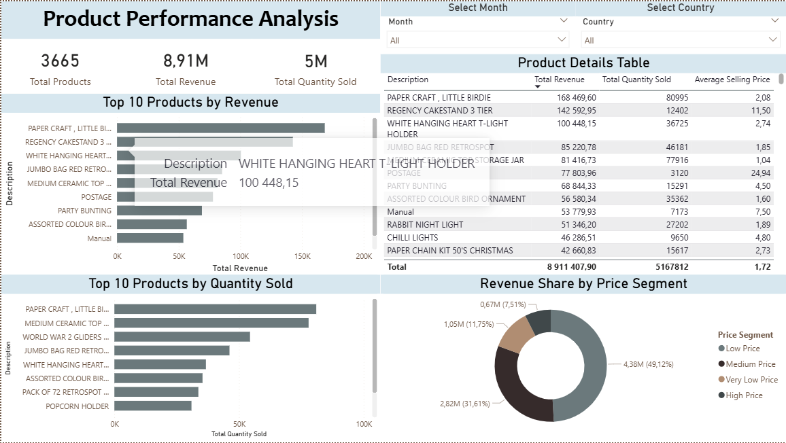
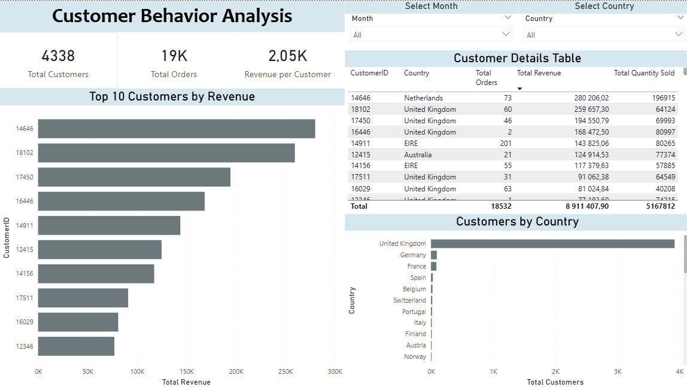
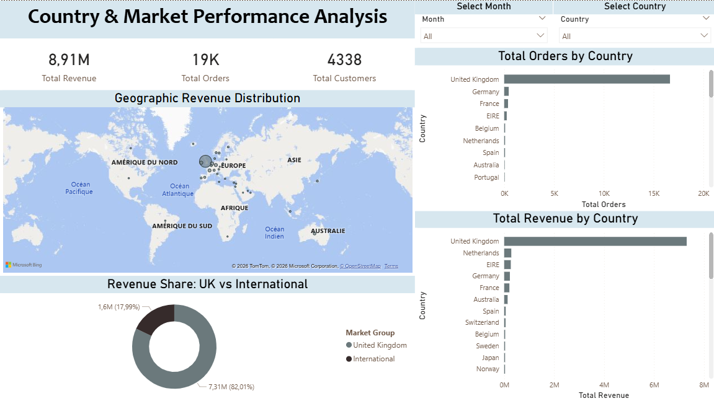

# E-Commerce Sales & Customer Analytics Dashboard

This project presents an interactive Power BI dashboard built using the Online Retail dataset.  
The objective is to analyze sales performance, product performance, customer behavior, and market distribution through clear business-oriented visualizations.

## Project Overview

The dashboard was designed to provide insights into e-commerce sales activity, including revenue trends, best-selling products, customer contribution, and country-level market performance.

## Dashboard Pages

### 1. Sales Overview
Provides a global view of the business performance, including total revenue, total orders, total customers, total quantity sold, average order value, monthly revenue trend, top products, top customers, and revenue by country.

### 2. Product Performance Analysis
Analyzes product performance using top 10 products by revenue, top 10 products by quantity sold, product details table, and revenue share by price segment.

### 3. Customer Behavior Analysis
Focuses on customer-level insights, including top customers by revenue, customer details, number of orders, and customers by country.

### 4. Country & Market Performance Analysis
Analyzes geographic performance using a map, total orders by country, total revenue by country, and revenue share between the United Kingdom and international markets.

## Tools Used

- Power BI
- Power Query
- DAX
- Excel
- Online Retail Dataset

## Key Measures

- Total Revenue
- Total Orders
- Total Customers
- Total Quantity Sold
- Average Order Value
- Average Selling Price
- Revenue per Customer

## Key Insights

- The United Kingdom represents the majority of total revenue.
- A small group of products contributes significantly to sales performance.
- Top customers generate an important share of the total revenue.
- Price segmentation helps understand how different product price ranges contribute to revenue.

## Project Objective

The goal of this project is to demonstrate skills in data cleaning, DAX measures, dashboard design, business analysis, and data visualization using Power BI.

## Dashboard Preview

### Sales Overview

### Product Performance Analysis

### Customer Behavior Analysis

### Country & Market Performance Analysis

